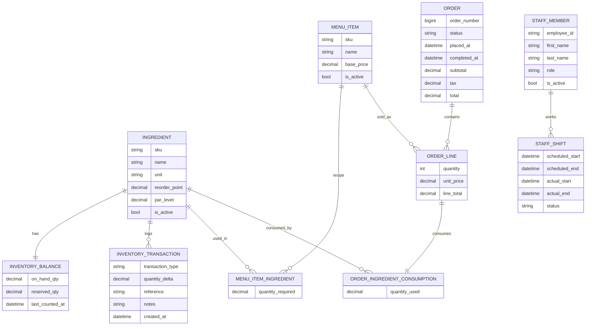

# Fast-Food Tracking ERD

```mermaid
erDiagram
    INGREDIENT ||--|| INVENTORY_BALANCE : has
    INGREDIENT ||--o{ INVENTORY_TRANSACTION : logs
    INGREDIENT ||--o{ MENU_ITEM_INGREDIENT : used_in
    MENU_ITEM ||--o{ MENU_ITEM_INGREDIENT : recipe
    MENU_ITEM ||--o{ ORDER_LINE : sold_as
    ORDER ||--o{ ORDER_LINE : contains
    ORDER_LINE ||--|| ORDER_INGREDIENT_CONSUMPTION : consumes
    INGREDIENT ||--o{ ORDER_INGREDIENT_CONSUMPTION : consumed_by
    STAFF_MEMBER ||--o{ STAFF_SHIFT : works

    INGREDIENT {
        string sku
        string name
        string unit
        decimal reorder_point
        decimal par_level
        bool is_active
    }

    INVENTORY_BALANCE {
        decimal on_hand_qty
        decimal reserved_qty
        datetime last_counted_at
    }

    INVENTORY_TRANSACTION {
        string transaction_type
        decimal quantity_delta
        string reference
        string notes
        datetime created_at
    }

    MENU_ITEM {
        string sku
        string name
        decimal base_price
        bool is_active
    }

    MENU_ITEM_INGREDIENT {
        decimal quantity_required
    }

    ORDER {
        bigint order_number
        string status
        datetime placed_at
        datetime completed_at
        decimal subtotal
        decimal tax
        decimal total
    }

    ORDER_LINE {
        int quantity
        decimal unit_price
        decimal line_total
    }

    ORDER_INGREDIENT_CONSUMPTION {
        decimal quantity_used
    }

    STAFF_MEMBER {
        string employee_id
        string first_name
        string last_name
        string role
        bool is_active
    }

    STAFF_SHIFT {
        datetime scheduled_start
        datetime scheduled_end
        datetime actual_start
        datetime actual_end
        string status
    }
```
